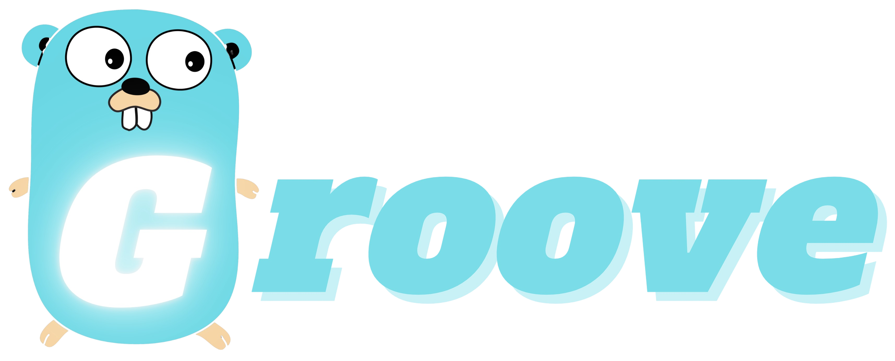

<p align="center"></p>

<p align="center">
  <a href="https://github.com/xvrzhao/groove/issues"></a>
  <a href="https://github.com/xvrzhao/groove/blob/main/LICENSE"></a>
  <a href="https://github.com/xvrzhao/groove/tags"></a>
</p>

Groove is a minimalist HTTP/Cron service scaffold that integrates basic Web development packages, including JWT authentication, logging, password hashing, paging queries, standardized HTTP response formats, etc. It also comes with a one-click CRUD interface generation tool suitable for agile development, making it very suitable for the development of small singleton backend services.

[中文文档](./README-CN.md)

## Table of Contents

<!-- toc -->

- [Usage](#usage)
- [Groove Design Philosophy](#groove-design-philosophy)
  * [Environment Variables](#environment-variables)
    + [Reading Environment Variables](#reading-environment-variables)
    + [Environment Variable Files](#environment-variable-files)
    + [Environment Variables and Image Publishing](#environment-variables-and-image-publishing)
    + [When to Read Environment Variables](#when-to-read-environment-variables)
  * [Image and Version](#image-and-version)
  * [HTTP Request Lifecycle](#http-request-lifecycle)
    + [Controller Layer](#controller-layer)
    + [Service Layer](#service-layer)
    + [Model Layer](#model-layer)
  * [Database Migration File](#database-migration-file)
  * [DEBUG and Unit Testing](#debug-and-unit-testing)
  * [Graceful Shutdown](#graceful-shutdown)
- [Groove Shortcuts](#groove-shortcuts)
  * [Launch the Groove App Locally](#launch-the-groove-app-locally)
  * [Generate CRUD code](#generate-crud-code)
  * [Code Formatting and Static Check](#code-formatting-and-static-check)
  * [Publish Image](#publish-image)

<!-- tocstop -->

## Usage

```bash
# Install the Groove CLI, and make sure your $GOBIN ($GOPATH/bin) directory is added to your $PATH env variable.
go install github.com/xvrzhao/groove@latest

# Create your Groove project.
groove create my-app

# Start developing your project using vscode.
code ./my-app
```

## Groove Design Philosophy

### Environment Variables

#### Reading Environment Variables

Groove's design philosophy is that the Go application itself is a stateless application. It is just a logical machine, and different environment variables (states) will give it different behaviors.

The Go application itself does not handle the export of environment variables or the reading of configuration files. The environment variables are read by the `bin/go` (local environment) and `bin/exec` (in the container) scripts at startup. The `.env` file under the project root path is exported to the application. The Go application only needs to read from the environment variables. Therefore, when you execute the `go` command, you need to use `bin/go` instead, for example: `bin/go test ./...`, `bin/go run ./cmd/http`, etc.

**Another reason for this design is that if the Go application handles the reading of configuration files, the working directory (`pwd`) will be changed to the unit test package when executing unit tests, which will cause the configuration file to be unable to read and an error will be reported.**

#### Environment Variable Files

Whether in a local environment or an online container environment, starting the Groove application will read the `.env` file from the project root path. To prevent important information from being leaked, the file has been included in `.gitignore`. Therefore, you need to copy `.env`.example and name it `.env` before starting the project.

#### Environment Variables and Image Publishing

Groove scaffolding integrates the `make publish` shortcut command to build and publish images. If you read the `Makefile` and `Dockerfile` files carefully, you will find that the publishing environment will be specified according to the `env` parameter of `make publish` or the `PUBLISH_MODE` parameter of `docker build` during the image building process, and in the `Dockerfile`, the **.env.environment.${specifiedEnvironment}** file will be copied to `.env` for application use according to the specified environment.

Therefore, you can create multiple different environment variable files, such as **.env.development**, **.env.production**, etc. In this way, when executing, for example, `make publish version=1.0.0 env=development` or `make publish version=1.0.0 env=production`, the corresponding environment variable files will be applied respectively.

#### When to Read Environment Variables

Go applications are composed of several packages, and packages are independent and autonomous units that provide available interfaces to the outside world. Therefore, in order to ensure that the content provided by the package is always available, the content provided to the outside world should be initialized in the initialization phase of the package (`init` function), so the environment variables should be read in the `init` function and the exposed content should be initialized.

You can refer to the `db/conn.go` file. The `db` package only provides the `Client` variable to the outside world. `Client` is a database client, and its initialization and configuration reading are completed in the `init` phase.

**Groove strongly discourages putting initialization work in the running phase (after the `main` function starts executing), which will also make unit testing impossible in some cases, unless the initialization code is manually written in the unit test, such as initializing the database connection.**

### Image and Version

Groove is composed of two applications, HTTP and Cron. Since Groove is a singleton project, changes to the public package will affect both applications. Therefore, Groove believes that the two program entries should keep the same version number. The image building process will compile both entries into the same image. When deploying, you only need to use different startup instructions for the same image (`CMD` of `Dockerfile`, or `command` of `docker-compose`).

### HTTP Request Lifecycle

Groove respects the classic *Controller - Service - Model* three-layer architecture design.

#### Controller Layer

The Controller layer is responsible for the verification of request parameters and the encapsulation of response data.

#### Service Layer

The Service layer is the core of the business logic. The API of this layer should have general and abstract capabilities for different business modules to call. The purpose of extracting the Service layer is to simulate the calling relationship of the microservice architecture. **Each Service is an independent microservice**, and Services cooperate with each other and call each other. **At the same time, the Service of each business module should only have the authority to call the Model under its jurisdiction, and should not call the Model outside its jurisdiction. If it is to be used, it should be implemented through API calls between Services.** Such strict code discipline will be very convenient for the real microservice splitting in the future.

#### Model Layer

The Model layer is the data model used in the business. It only declares the data attributes of the Model itself and does not contain any business logic.

### Database Migration File

Groove uses a simple SQL file to represent the DDL operation of the database. Its naming rule is `date.${businessName}.sql`. In this way, the files will be sorted in date order. Since the project may be developed by multiple people, this sorting can ensure that SQL can be executed in the correct order during deployment, and there will be no wrong overwriting operations.

### DEBUG and Unit Testing

Groove comes with a vscode `launch.json` file, which declares the HTTP debug startup entry internally. When it starts, it will read the environment variables from `.env` to facilitate debugging.

Groove advocates writing unit tests.

### Graceful Shutdown

Although the Go application is started by the `bin/exec` script in the container, it can ensure that the Go application is the main program of the container (pid: 1) and can normally receive the `TERM`/`KILL` and other signals of the container. You can write the graceful shutdown logic in the code yourself.

## Groove Shortcuts

### Launch the Groove App Locally

```bash
# Start HTTP service locally.
make run-http
# Start the Cron program locally.
make run-cron
```

### Generate CRUD code

```bash
# Parameter description:
#   table: database table name
#   model: model name to generate
make crud table=x_persons model=Person
```

### Code Formatting and Static Check

```bash
make code
```

### Publish Image

```bash
# Parameter description:
#   version: version number
#   env: published environment, different environments will package different env files
make publish version=1.0.0 env=development
```
